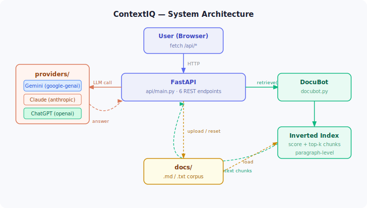

# ContextIQ

> Multi-provider RAG system with an agentic reasoning mode, pluggable LLM backends, and a quantified retrieval evaluation harness.

Developers working in large codebases spend significant time chasing documentation. ContextIQ solves this with a retrieval-augmented Q&A pipeline: users ask questions about a codebase, the system retrieves the most relevant documentation chunks, and a pluggable LLM synthesizes a grounded, source-cited answer — refusing to guess when evidence is insufficient.

The system supports three AI providers (Gemini, Claude, OpenAI), four query modes including an observable agentic reasoning chain, runtime document upload with incremental index updates, and a formal evaluation harness that measures retrieval hit rate before and after corpus changes.

---

## Features

- **Four query modes** — RAG, Agentic (multi-step reasoning chain), Naive LLM (AI only), Retrieval Only (raw snippets, no AI)
- **Agentic mode** — LLM plans what to search for, executes retrieval with those terms, then synthesizes — intermediate steps visible in the chat UI
- **Multi-provider** — Gemini, Claude (Anthropic), ChatGPT (OpenAI); missing keys are gracefully skipped
- **Custom document upload** — extend the knowledge base at runtime with `.md` or `.txt` files
- **Provider badge** — each chat response is labeled with the provider that answered it
- **REST API** — FastAPI backend with auto-generated Swagger docs at `/docs`
- **Evaluation harness** — retrieval hit rate scoring with before/after source comparison
- **Hot reload** — `DEV_MODE=true` enables file-watching auto-restart via uvicorn

---

## System Architecture

```
┌─────────────────────────────────────────────────────────────┐
│  Client Layer                                               │
│  Browser (Vanilla JS)  ·  CLI (cli.py)  ·  Eval harness    │
└────────────────────────┬────────────────────────────────────┘
                         │ HTTP fetch / direct import
┌────────────────────────▼────────────────────────────────────┐
│  API Layer  —  api/main.py  (FastAPI)                       │
│  POST /api/chat  ·  POST /api/docs/upload                   │
│  GET  /api/providers  ·  GET /api/health                    │
│  Pydantic request/response models, static file serving      │
└──────────────┬──────────────────────────┬───────────────────┘
               │                          │
┌──────────────▼───────────┐  ┌───────────▼──────────────────┐
│  Retrieval Engine        │  │  Provider Abstraction Layer   │
│  docubot.py              │  │  providers/                   │
│                          │  │                               │
│  • load + chunk docs     │  │  BaseLLMClient (ABC)          │
│    (paragraph-level)     │  │  ├── GeminiClient             │
│  • build inverted index  │  │  ├── ClaudeClient             │
│  • overlap scoring       │  │  └── OpenAIClient             │
│  • top-k retrieval       │  │                               │
│  • incremental updates   │  │  shared: plan_retrieval()     │
│    (no full rebuild)     │  │          _build_rag_prompt()  │
└──────────────────────────┘  └──────────────────────────────┘
```

**Request flow (RAG mode):**

```
POST /api/chat {message, provider, mode="RAG"}
  → DocuBot.retrieve(query)          ← inverted index + overlap score
  → top-k (filename, chunk) pairs
  → BaseLLMClient._build_rag_prompt  ← inject chunks + refusal instruction
  → provider SDK call  (Gemini / Claude / OpenAI)
  → ChatResponse {answer, steps}     ← source-cited, grounded answer
```

**Agentic mode adds a planning step:**

```
POST /api/chat {mode="Agentic"}
  → client.plan_retrieval(query)     ← LLM generates targeted search terms
  → DocuBot.retrieve(search_terms)
  → client.answer_from_snippets()
  → ChatResponse {answer, steps: [plan, retrieved_sources]}
```



---

## Scalability & Limitations

**What scales well**

- The provider abstraction (`BaseLLMClient` ABC) makes adding a new LLM backend a ~30-line change with no modifications to `docubot.py` or the API layer.
- `add_documents()` patches the existing inverted index at the new chunk offset rather than rebuilding from scratch — hot document ingestion does not degrade with corpus size.
- The API, CLI, and evaluation harness all consume the same `DocuBot` interface, so retrieval improvements are immediately reflected across all surfaces.

**Known constraints and upgrade paths**

| Area | Current limitation | Production upgrade |
|------|-------------------|-------------------|
| Retrieval quality | Keyword overlap; synonym blindness | Sentence-transformer embeddings + FAISS |
| Concurrency | Sync LLM calls block uvicorn worker threads | `async def` endpoints + async SDK clients |
| Response latency | Full answer buffered before return | Server-Sent Events streaming |
| State durability | In-memory index; lost on restart | Persist to SQLite/disk or a vector store |
| Reliability | No retry or provider fallback | Exponential backoff + failover to next provider |

The evaluation harness provides a regression baseline so that any retrieval strategy change (e.g., swapping to embeddings) can be measured against the documented 75% hit rate on the default corpus.

---

## Project Structure

```
contextiq/
├── api/
│   └── main.py          FastAPI app — 6 REST endpoints
├── frontend/
│   ├── index.html
│   ├── style.css
│   └── app.js
├── providers/
│   ├── base.py          Shared interface + prompt builders
│   ├── gemini.py
│   ├── claude.py
│   └── openai.py
├── docs/                Default documentation corpus
├── sample_uploads/      Demo docs for custom upload feature
├── tests/
│   └── evaluation.py    Retrieval evaluation harness
├── docubot.py           Retrieval engine
├── samples.py           Sample queries
├── cli.py               Terminal interface
└── server.py            Uvicorn entry point
```

---

## Running with Docker

```bash
cp .env.example .env
# fill in at least one API key in .env

docker compose up --build
```

Open **http://localhost:8000**. API keys are injected from `.env` at runtime — they are never baked into the image.

---

## Setup (local)

**Requirements:** Python 3.9+

### 1. Create and activate a virtual environment

```bash
python -m venv .venv
source .venv/bin/activate      # macOS / Linux
.venv\Scripts\activate         # Windows
```

### 2. Install dependencies

```bash
pip install -r requirements.txt
```

### 3. Configure environment variables

```bash
cp .env.example .env
```

Open `.env` and fill in at least one API key:

```
GEMINI_API_KEY="your_key_here"       # https://aistudio.google.com/
ANTHROPIC_API_KEY="your_key_here"    # https://console.anthropic.com/
OPENAI_API_KEY="your_key_here"       # https://platform.openai.com/
```

Leave unused keys as `"your_xxx_api_key_here"` — the app will mark those providers as unavailable but continue running. Retrieval Only mode works with no keys at all.

---

## Running

### Web app

```bash
python server.py
```

Open **http://127.0.0.1:8000** in your browser.

**Development mode** (hot reload on file save):

```bash
# In .env, set DEV_MODE="true", then:
python server.py
```

### CLI

```bash
python cli.py
```

### Evaluation harness

```bash
python tests/evaluation.py
```

Prints retrieval hit rate across sample queries, plus a before/after comparison showing improvement when a custom document is uploaded.

---

## API Reference

The full interactive API reference is available at **http://127.0.0.1:8000/docs** (Swagger UI) when the server is running.

| Method | Endpoint | Description |
|--------|----------|-------------|
| `GET` | `/api/health` | Health check |
| `GET` | `/api/providers` | List providers and availability |
| `GET` | `/api/docs` | Current document source count |
| `POST` | `/api/chat` | Send a query (provider, mode, message) |
| `POST` | `/api/docs/upload` | Upload custom `.md` / `.txt` files |
| `POST` | `/api/docs/reset` | Reset to default docs |

---

## Sample Interactions

**RAG mode — question answered from docs**
```
Q: Where is the auth token generated?
A: Based on AUTH.md, tokens are created by the generate_access_token
   function inside auth_utils.py and signed using AUTH_SECRET_KEY.
```

**RAG mode — correct refusal**
```
Q: Is there any mention of payment processing in these docs?
A: I do not know based on the docs I have.
```

**Agentic mode — observable reasoning chain**
```
Q: Where is the auth token generated?

① Plan
   The question asks about token creation in the auth flow.
   Searching: "token generate auth utils"

② Retrieved
   AUTH.md · 3 chunks

A: Based on AUTH.md, tokens are created by the generate_access_token
   function inside auth_utils.py and signed using AUTH_SECRET_KEY.
```

**Custom doc upload — extended knowledge**
```
Q: How do I run the app with Docker?
A: (fails before upload)

After uploading sample_uploads/DEPLOYMENT.md:
A: Run the application using: docker run -p 8080:8080 contextiq-app
```

---

## Design Decisions

**Keyword retrieval over embeddings** — The retrieval engine uses an inverted word index and overlap scoring instead of semantic embeddings. This keeps the system dependency-free (no vector DB, no embedding API calls) and makes the failure modes transparent, which is useful for evaluation and teaching. The tradeoff is synonym blindness: "generated" does not match "created".

**Paragraph-level chunking** — Documents are split on blank lines rather than at the document level. Smaller units reduce noise in retrieval but can fragment answers that span multiple paragraphs.

**Strict RAG prompt** — The LLM is explicitly instructed to refuse when retrieved snippets are insufficient, and to cite source files in its answer. This reduces hallucination at the cost of some false refusals.

**FastAPI over all-in-one frameworks** — Replacing Gradio with a decoupled FastAPI backend and vanilla JS frontend improves scalability: the API can be consumed by any client (browser, CLI, tests, external tools) and the auto-generated Swagger UI documents the contract for free.

**Provider abstraction** — All three LLM providers share a base class with shared prompt builders. Swapping a provider requires changing one line, and new providers can be added without touching `docubot.py` or the API layer.

**Agentic mode separates planning from retrieval** — Rather than passing the raw user query directly to the index, the LLM first decides what terms are most likely to appear in the relevant documentation. This decouples query intent from keyword matching and produces observable intermediate steps (reasoning + search terms + retrieved sources) that make the decision chain auditable.

---

## Testing Summary

The evaluation harness in `tests/evaluation.py` runs all sample queries against the retrieval system and reports hit rate — the fraction of queries where at least one retrieved chunk came from the expected source file.

| Corpus | Queries | Hit rate |
|--------|---------|----------|
| Default docs only (4 sources) | 8 | 75% |
| Default + DEPLOYMENT.md (5 sources) | 11 | 73%* |

*The extended set includes 3 new queries that only resolve after uploading `DEPLOYMENT.md`. Adding that document raised the hit rate on the extended query set from 55% to 73% (+18%).

**What failed:** Two query types consistently miss — "how do I connect to the database?" (keyword mismatch: the doc says "DATABASE_URL", not "connect to") and queries with hyphenated env vars like `LOG_LEVEL` (indexed as one token, not matched by individual words). Both are known limitations of keyword-only retrieval.
